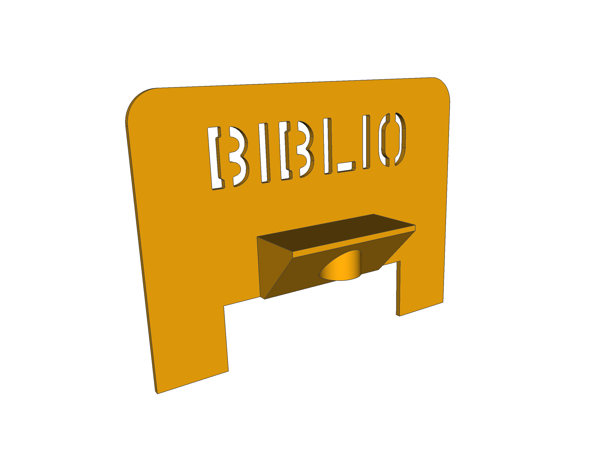
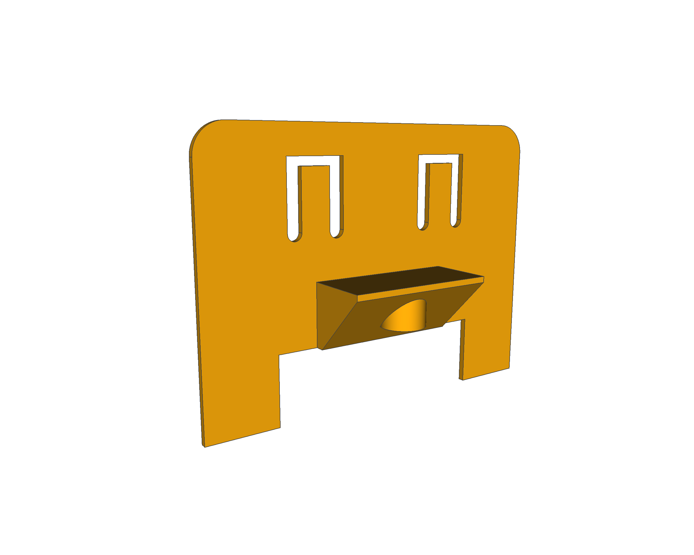
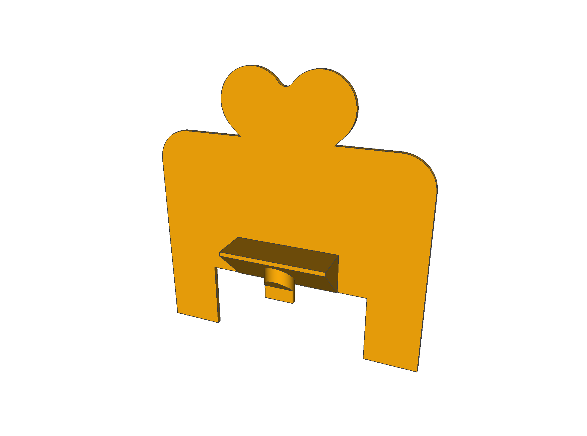
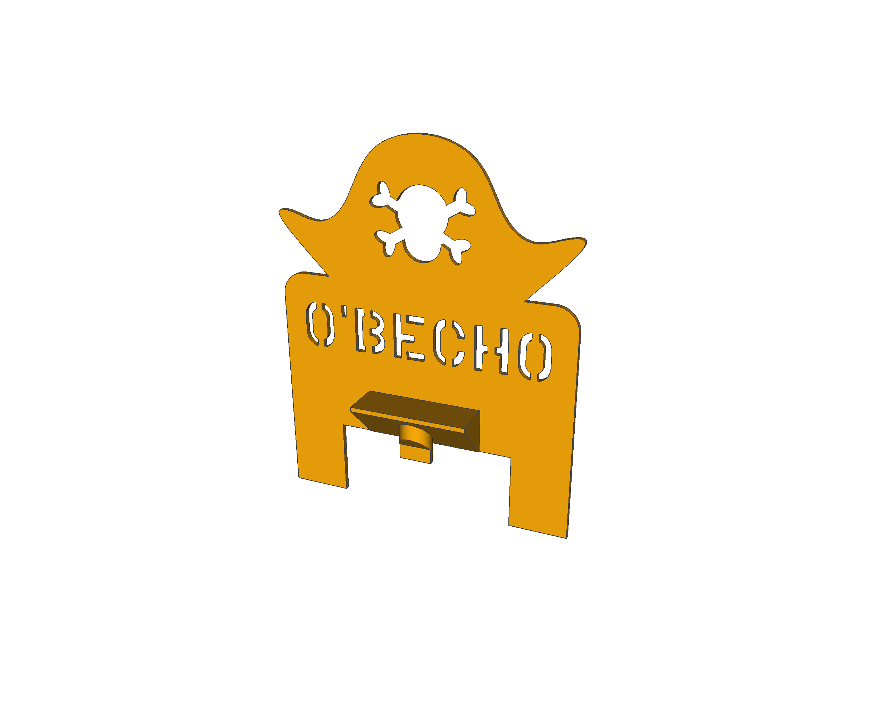
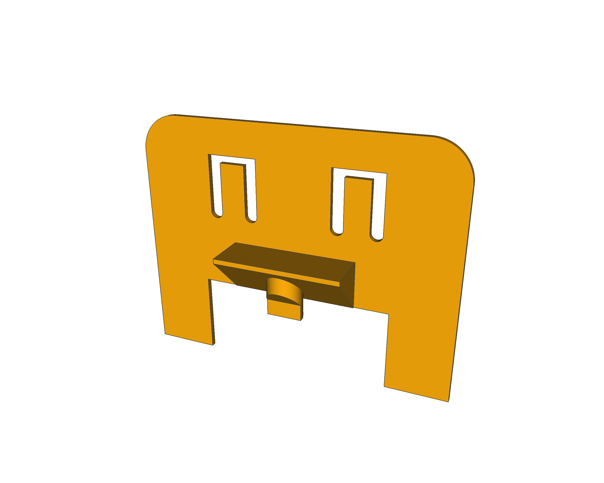
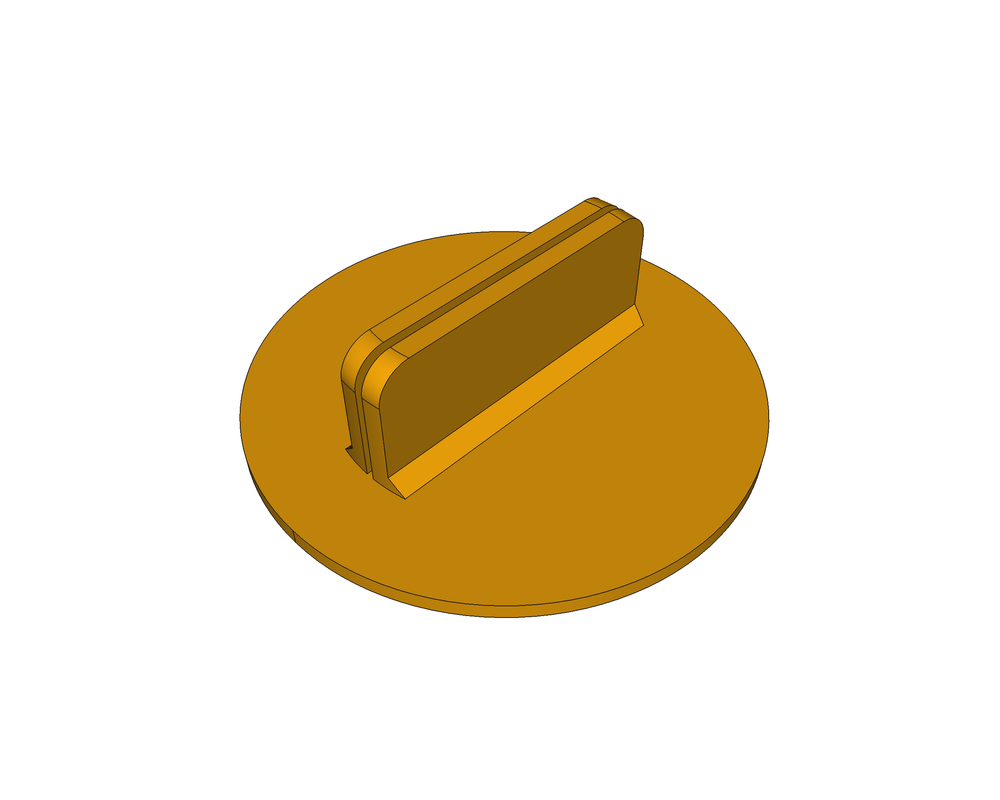

# escornabot-extras
Pezas extra para o proxecto Escornabot

## Pezas para o Escornabot de Bibliotecas Creativas (Escornabot Brivoi Compactus)

  ### Carauta base
  Ficheiros &rarr; [STL](BibliotecasCreativas/escornafaceBrivoiCompactus.png) | 
  [FreeCAD](BibliotecasCreativas/escornafaceBrivoiCompactus.FCStd)
  

  ### Carauta logo Bibliotecas Creativas
  Ficheiros &rarr; [STL](BibliotecasCreativas/escornafaceBibliotecasCreativas.stl) | 
  [FreeCAD](BibliotecasCreativas/escornafaceBibliotecasCreativas.FCStd)
  

  ## Carauta suxeita papel/cartón (Compactus)
  Ficheiros &rarr; [STL](BibliotecasCreativas/escornafaceBCClip.stl) | 
  [FreeCAD](BibliotecasCreativas/escornafaceBCClip.FCStd)
  

## Carautas para Escornabot Brivoi DIY
  A **carauta base** está dispoñible no [repositorio Escornabot Brivoi DIY](https://github.com/mgesteiro/escornabot-Brivoi-DIY/tree/master/3D#escornaface)

  ### Carauta porta ollos
  Ficheiros &rarr; [STL](carautas/escornaface-eyes.stl) | 
  [FreeCAD](carautas/escornaface-eyes.FCStd)
  

  ### Carauta Escornapirata
  Ficheiros &rarr; [STL](carautas/escornaface-pirate.stl) | 
  [FreeCAD](carautas/escornaface-pirate.FCStd)
  

  ### Carauta suxeita papel/cartón (DIY)
  Ficheiros &rarr; [STL](carautas/escornaface-clips.stl) | 
  [FreeCAD](carautas/escornaface-clips.FCStd)
  

## Outras pezas

  ### Pequena peana para suxeitar de pe tarxetas de papel/cartón
  Ficheiros &rarr; [STL](outros/card-holder.stl) | 
  [FreeCAD](outros/card-holder.FCStd)
  

## LICENCIA

Este traballo está suxeito á licencia [GNU General Public v3.0 License](LICENSE-GPLV30).
Todos os ficheiros multimedia e de datos que non sexan código fonte están suxeitos á licencia [Creative Commons Attribution 4.0 BY-SA license](LICENSE-CCBYSA40).

Máis información acerca destas licencias en [licencias Opensource](https://opensource.org/licenses/) e [licencias Creative Commons](https://creativecommons.org/licenses/).
