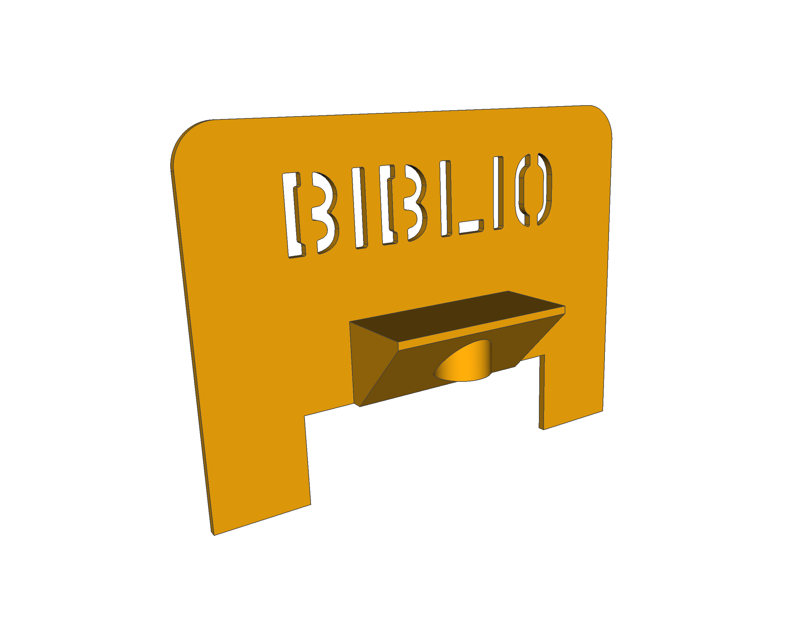
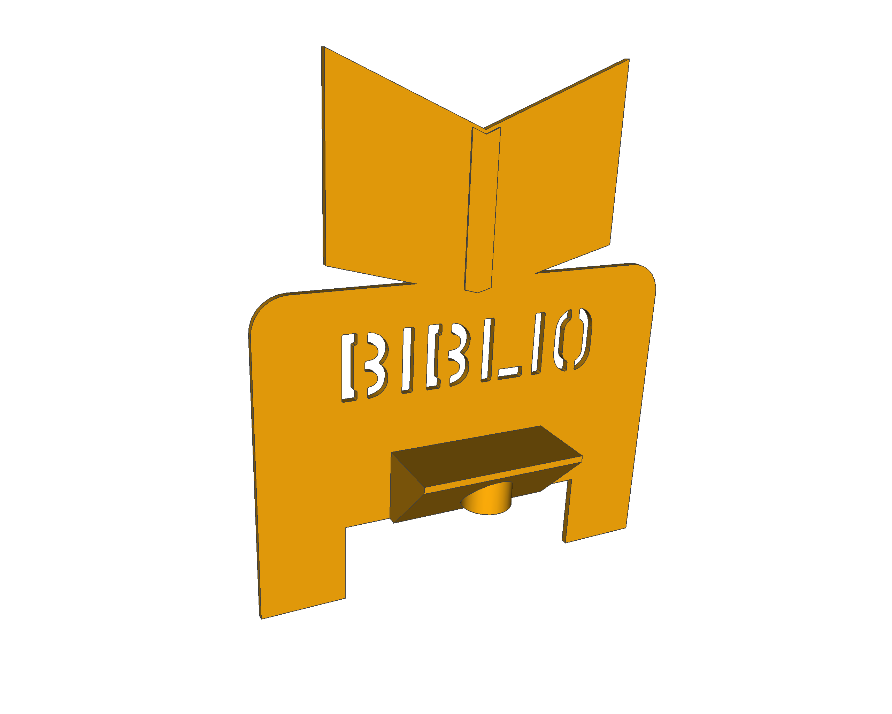
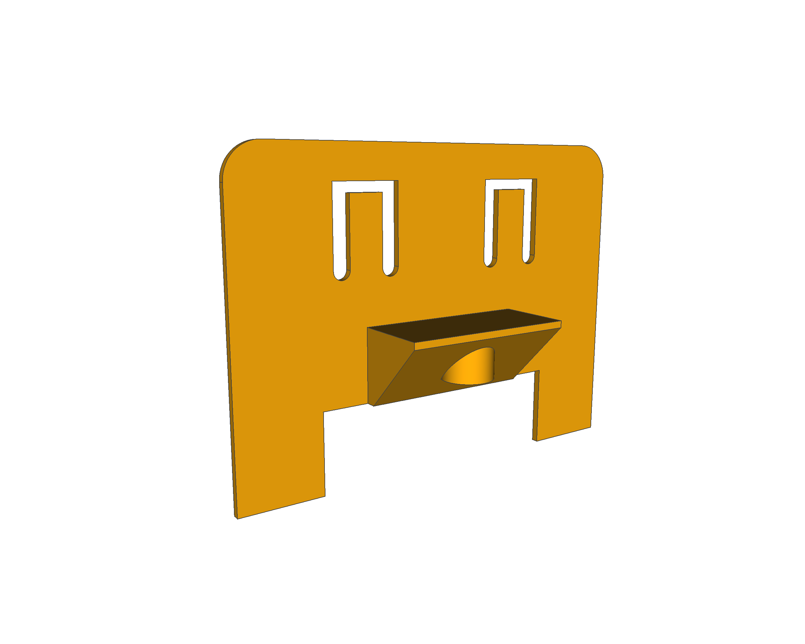
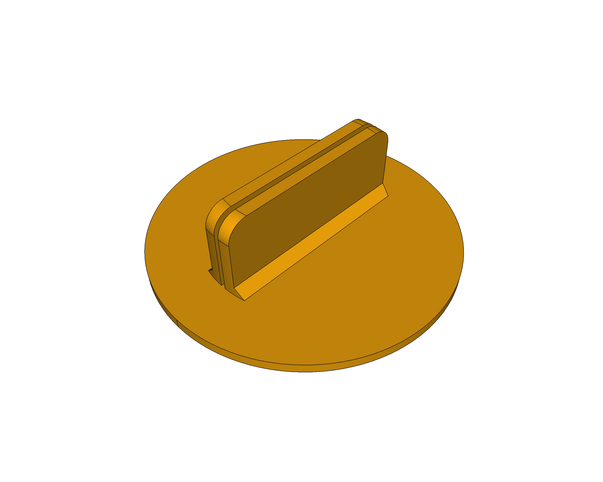

# escornabot-extras
Pezas extra para o proxecto Escornabot

## Carauta para Brivoi Compactus (de Bibliotecas Creativas)

## Carauta de Bibliotecas Creativas

## Carauta para Brivoi Compactus suxeita papel/cartón

## Pequena peana para suxeitar de pe tarxetas de papel/cartón

## LICENCIA

Este traballo está suxeito á licencia [GNU General Public v3.0 License](LICENSE-GPLV30). 
Todos os ficheiros multimedia e de datos que non sexan código fonte están suxeitos á licencia [Creative Commons Attribution 4.0 BY-SA license](LICENSE-CCBYSA40).

Máis información acerca destas licencias en [licencias Opensource](https://opensource.org/licenses/) e [licencias Creative Commons](https://creativecommons.org/licenses/).
